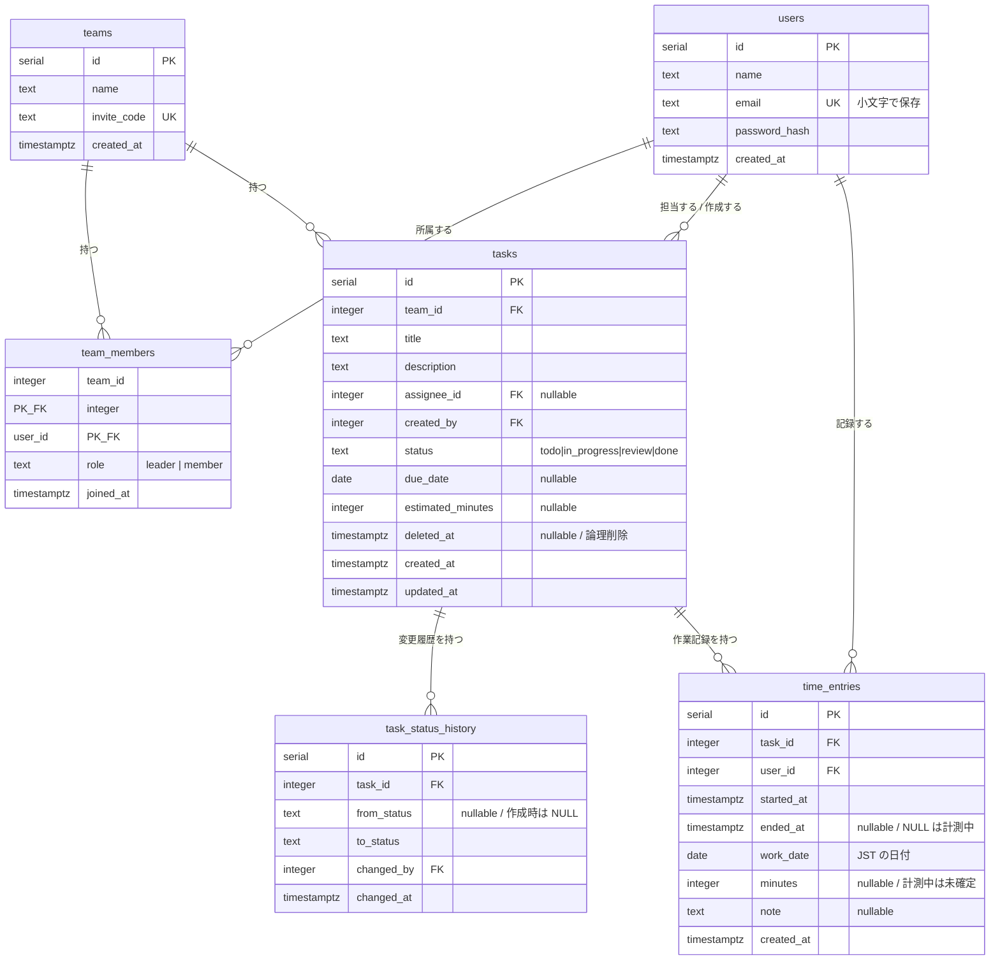

# サービスの説明と設計

## 1. このサービスは何か

小規模チーム（5〜20人程度）向けのタスク管理ツールである。中核となるのは次の3点で、
多機能であることよりもこの3点が確実に動くことを優先している。

1. リーダーがメンバーにタスクを割り振る
2. 各タスクの進捗状況を記録・閲覧する
3. 各タスクに取り組んだ時間を記録・閲覧する

### 解決したい課題

チーム作業では「誰が何を持っているか」と「それにどれだけ時間がかかったか」が
見えなくなりやすい。前者が見えないと作業の偏りや抜け漏れが起き、後者が見えないと
次回の見積もりが改善されない。この2つを1つの画面から把握できるようにした。

### 想定する使い方

- リーダーがチームを作り、招待コードを配ってメンバーを集める
- リーダーがタスクを作り、担当者・期限・見積時間を設定する
- メンバーは自分のタスクを進め、ステータスを更新し、作業時間を記録する
- リーダーはダッシュボードで、メンバーごとの負荷と見積と実績の差を確認する

## 2. 機能一覧

| 区分 | 機能 |
| --- | --- |
| 認証 | サインアップ、ログイン、ログアウト |
| チーム | 作成、招待コードによる参加、メンバー一覧、権限の変更、招待コードの再発行 |
| タスク | 作成、編集、削除（論理削除）、担当者の割り当て、ステータス変更と変更履歴、一覧の絞り込みと並べ替え |
| 作業時間 | タイマーによる計測（開始・停止）、手入力による登録・編集・削除 |
| 集計 | チームダッシュボード、タスク別の見積 vs 実績、個人ビュー（担当タスクと直近30日の推移） |
| 運用 | ヘルスチェック `/healthz` |

## 3. 技術構成

| 領域 | 採用 | 理由 |
| --- | --- | --- |
| 実行環境 | Node.js 22 | 仕様で指定。`--env-file` や `node:test` など標準機能で足りる範囲が広い |
| Web フレームワーク | Express 5 | 仕様で指定。ミドルウェアで責務を分けやすい |
| データベース | PostgreSQL | 仕様で指定。CHECK 制約・部分ユニークインデックス・集約関数を活用している |
| DB クライアント | `pg`（ORM なし） | 仕様で指定。SQL を直接書き、集計をデータベース側で完結させる |
| マイグレーション | `node-pg-migrate` | 仕様で指定。起動時に流す運用でも、アドバイザリロックにより二重適用が起きない |
| 画面 | EJS によるサーバーサイドレンダリング | 単一の Web サービスとしてデプロイするため。SPA にはしない |
| 認証 | bcrypt + JWT（httpOnly Cookie） | 仕様で指定 |
| テスト | `node:test` + `supertest` | 仕様で指定。ビルド不要で実行できる |

言語は素の JavaScript を採用した。仕様の技術スタックに TypeScript の記載がなく、
ORM を使わない構成では SQL の戻り値に手作業で型を付けることになり、
型付けの恩恵が小さいと判断したため。

## 4. データモデル



### 各テーブルの役割

- **users** — アカウント。メールアドレスは小文字に正規化して保存する
- **teams** — チーム。招待コードを1つ持ち、リーダーが再発行できる
- **team_members** — 所属。`(team_id, user_id)` の複合主キーで、1人が複数チームに所属でき、
  チームごとに異なる権限を持てる
- **tasks** — タスク。チームに属し、担当者は任意
- **task_status_history** — ステータス変更の履歴。誰がいつ何から何に変えたかを残す
- **time_entries** — 作業時間。タイマーと手入力の両方が同じ表に入る

### 制約でモデルを守る

アプリ側のバグでデータが壊れないよう、不変条件はデータベース側にも置いた。

| 制約 | 目的 |
| --- | --- |
| `users.email = lower(email)` の CHECK | アプリ側の小文字化を忘れても二重登録を防ぐ |
| `role IN ('leader','member')` の CHECK | 想定外の権限値が入らない |
| `status IN (...)` の CHECK | 想定外のステータスが入らない |
| `(ended_at IS NULL) = (minutes IS NULL)` の CHECK | 「計測中なのに分が確定している」等の矛盾を防ぐ |
| `time_entries(user_id) WHERE ended_at IS NULL` の部分ユニークインデックス | 1人が同時に2件計測することを防ぐ |
| `tasks` の `updated_at` トリガー | 更新日時のセット漏れを防ぐ |

ステータスと権限は `enum` 型ではなく CHECK 制約にした。値の追加や変更を
マイグレーションで扱いやすいためである。

### 外部キーの削除時の挙動

| 参照 | 挙動 | 理由 |
| --- | --- | --- |
| `tasks.created_by → users` | RESTRICT | 作成者が消えると履歴の説明がつかなくなる |
| `tasks.assignee_id → users` | SET NULL | 担当者が抜けてもタスクと実績は残す |
| `task_status_history.task_id → tasks` | CASCADE | タスクの物理削除に追随させる |
| `time_entries.task_id → tasks` | CASCADE | 同上。ただし通常は論理削除なので消えない |
| `team_members` の両方 | CASCADE | チームまたはユーザーが消えれば所属も消える |

## 5. 権限設計

| 操作 | leader | member |
| --- | --- | --- |
| タスクの作成・編集・削除 | ○ | × |
| タスクの割り当て・再割り当て | ○ | × |
| 自分に割り当てられたタスクのステータス変更 | ○ | ○ |
| 自分の作業時間の記録・編集・削除 | ○ | ○ |
| 他人の作業時間の編集 | × | × |
| チーム全体のタスク・集計の閲覧 | ○ | ○ |
| メンバーの招待・role 変更 | ○ | × |

### ミドルウェアへの集約

権限判定はルートハンドラに書かず、ミドルウェアに集約している。
判定が各ハンドラに散ると、新しいルートを足したときに書き忘れが起きるためである。

| ミドルウェア | 役割 |
| --- | --- |
| `attachUser` | Cookie の JWT を検証し `req.user` を埋める |
| `requireAuth` / `requireGuest` | ログインの要否を判定する |
| `loadTeam` | `:teamId` の所属を確認し `req.team` / `req.membership` を埋める |
| `requireLeader` | リーダー専用の操作を制限する |
| `loadTask` | `:taskId` を読み込む。チーム外・削除済みは弾く |
| `requireStatusChangePermission` | リーダーまたは担当者本人のみ許可する |
| `loadOwnEntry` | 作業時間は本人のもの以外を扱わせない |

ルーターの入れ子でこれを強制している。タスクとダッシュボードは
`/teams/:teamId` のルーター配下にマウントしてあるため、**`loadTeam` を通らずに
到達できる経路が存在しない**。

```
/teams                       … requireAuth
  /teams/:teamId             … loadTeam（所属確認）
    /teams/:teamId/tasks     … loadTask（タスク特定）
      …/time-entries         … loadOwnEntry（本人確認）
    /teams/:teamId/dashboard
```

## 6. 画面とルーティング

| メソッド | パス | 内容 | 権限 |
| --- | --- | --- | --- |
| GET | `/healthz` | 死活監視（DB 疎通を含む） | 不要 |
| GET/POST | `/signup` `/login` | サインアップ・ログイン | 未ログインのみ |
| POST | `/logout` | ログアウト | — |
| GET | `/` | `/teams` へリダイレクト | 要ログイン |
| GET | `/me` | 個人ビュー | 要ログイン |
| GET | `/teams` | 所属チーム一覧 | 要ログイン |
| GET/POST | `/teams/new` `/teams` | チーム作成 | 要ログイン |
| POST | `/teams/join` | 招待コードで参加 | 要ログイン |
| GET | `/teams/:teamId` | チーム詳細（メンバー一覧・招待コード） | メンバー |
| POST | `/teams/:teamId/members/:userId/role` | 権限変更 | リーダー |
| POST | `/teams/:teamId/invite-code` | 招待コード再発行 | リーダー |
| GET | `/teams/:teamId/tasks` | タスク一覧（絞り込み・並べ替え） | メンバー |
| GET/POST | `/teams/:teamId/tasks/new` `/tasks` | タスク作成 | リーダー |
| GET | `/teams/:teamId/tasks/:taskId` | タスク詳細 | メンバー |
| GET/POST | `…/tasks/:taskId/edit` `…/:taskId` | タスク編集 | リーダー |
| POST | `…/tasks/:taskId/status` | ステータス変更 | リーダーまたは担当者 |
| POST | `…/tasks/:taskId/delete` | 論理削除 | リーダー |
| POST | `…/time-entries/start` `/stop` | タイマー | メンバー |
| POST | `…/time-entries` | 手入力の登録 | メンバー |
| GET/POST | `…/time-entries/:entryId/edit` `/:entryId` | 手入力の編集 | 本人のみ |
| POST | `…/time-entries/:entryId/delete` | 手入力の削除 | 本人のみ |
| GET | `/teams/:teamId/dashboard` | チームダッシュボード | メンバー |

## 7. ディレクトリ構成と責務

```
src/
  app.js            Express アプリの組み立て（listen しない）
  server.js         0.0.0.0 で listen する
  config.js         環境変数の読み込みと起動時の検証
  db.js             接続プールと query ヘルパ
  lib/              純粋な部品（ハッシュ・JWT・入力検証・表示整形・定数）
  middleware/       認証・権限・エラーハンドリング
  models/           SQL によるデータアクセスと集計
  routes/           ルーティングと画面への受け渡し
migrations/         スキーマ変更の履歴
views/              EJS テンプレート
test/               node:test によるテスト
```

`app.js` と `server.js` を分けているのは、テストから `supertest` で
アプリを直接叩けるようにするためである。`listen` を含んでいると
テストのたびにポートを掴む必要が出てしまう。

SQL は `models/` の中だけに置いた。ルートハンドラから SQL を書けてしまうと、
プレースホルダの使い忘れや、削除済みタスクの除外漏れが散らばるためである。

## 8. 主要な設計判断

### 存在を伏せるため 403 ではなく 404 を返す

所属していないチームや他人の作業時間にアクセスすると **404** を返す。
403 を返すと「そのリソースは実在する」ことが分かってしまい、ID を順に
叩けばチームの存在や件数を外部から列挙できる。存在自体を伏せる方が安全である。

### タスクは論理削除する

タスクの削除は `deleted_at` を立てるだけで、行は残す。物理削除すると
紐づく作業時間と変更履歴も消え、**過去の集計値が遡って変わってしまう**ためである。
一覧と詳細からは除外されるが、実績は保持される。

### ステータス変更に楽観ロックをかける

`UPDATE tasks SET status = $3 WHERE id = $1 AND status = $2` として、
変更前のステータスを条件に含めている。画面を開いている間に他の人が先に
変更していた場合は 0 行更新となり、409 を返す。これが無いと、同時操作のときに
履歴の `from_status` が実際の遷移と食い違う。

### 手入力にも started_at / ended_at を埋める

手入力は日付と分だけを受け取るが、内部では日付の 00:00 JST を起点に分を足して
`started_at` と `ended_at` を組み立てている。埋めずに NULL のままにすると
「`ended_at` が NULL なら計測中」という判定に引っかかり、計測中が2件ある状態と
区別できなくなるためである。

### 日付は JST で、時刻は UTC で持つ

日時は UTC（`timestamptz`）で保存し、表示時に JST へ変換する。
一方で「その作業がどの日のものか」は `work_date`（`date`）として別に持つ。
UTC の時刻から日付を導くと、日本時間の早朝や深夜に集計対象の日がずれるためである。
タスクの期限も日付のみの値なので、SQL 側で文字列として取り出して時差の影響を断っている。

### 集計はすべて SQL で行う

`count(*) FILTER (WHERE ...)`、`sum()`、CTE、`generate_series` を使い、
集計をデータベース側で完結させている。全件を取得して JavaScript で数える方式は、
件数が増えたときに転送量とメモリに直接効いてくる。
「記録の無い日も 0 として並べる」処理も `generate_series` で日付の系列を作って
突き合わせており、アプリ側で穴埋めしていない。

### 並べ替えは許可リスト経由でのみ SQL に載せる

`ORDER BY` は値を文字列として SQL に埋め込む必要があるため、
リクエストの値をそのまま使うとインジェクションになる。
あらかじめ定義した対応表に載っているキーだけを受け付け、
それ以外は既定値に落としている。

### 最後のリーダーは降格できない

仕様に明記はないが、許すとチームを管理できる人が誰もいなくなり、
メンバー追加も権限変更も永久にできない状態に陥る。降格前にリーダー数を数え、
1人しかいない場合は拒否する。

## 9. セキュリティ

| 観点 | 対応 |
| --- | --- |
| パスワード | bcrypt でハッシュ化（本番はコスト12）。8文字以上を必須とする |
| セッション | JWT を httpOnly Cookie に格納。JavaScript から読めない |
| 通信 | 本番では Cookie に Secure 属性を付ける |
| CSRF | Cookie に `SameSite=Lax` を設定し、状態を変える操作はすべて POST に限定する |
| SQL インジェクション | 値は必ずプレースホルダで渡す。`ORDER BY` は許可リスト方式 |
| XSS | EJS の `<%= %>` によるエスケープを使う。生出力 `<%- %>` はテンプレートの include にのみ使用 |
| ユーザー列挙 | ログイン失敗時は未登録とパスワード違いで同じ応答を返す。未登録時もダミーハッシュと照合して応答時間を揃える |
| オープンリダイレクト | ログイン後の戻り先は自サイト内の絶対パスのみ許可する |
| 情報漏洩 | 権限外のリソースは 404 を返し、存在を伏せる |
| エラー | ユーザーには安全なメッセージのみ返し、詳細はログにだけ出す |

CSRF はトークン方式まで踏み込んでいない。授業の課題という前提のもと、
`SameSite=Lax` と POST 限定で現代のブラウザでは実質的に防げる範囲に留めた。
実運用に移す場合はトークン方式の追加を検討する必要がある。

## 10. テスト方針

`node:test` と `supertest` により、HTTP のリクエストからデータベースの状態まで
通して検証している。合計 **115件**。

権限まわりは特に重点的に書いた。検証している内容の例:

- 他チームのタスク・ダッシュボードが見えないこと（一覧・詳細・操作のすべて）
- 自分のチームの URL 配下に他チームのタスク ID を混ぜても弾かれること
- member がタスクを作成・編集・削除できないこと
- 担当外のタスクのステータスを member が変更できないこと
- リーダーであっても他人の作業時間を編集・削除できないこと
- 他チームのユーザーを担当者にできないこと
- 計測中が同時に2件にならないこと
- 並べ替えパラメータに SQL を混ぜてもテーブルが壊れないこと

### テストが本番データを壊さない仕組み

テストは対象データベースを truncate しながら実行するため、接続先を誤ると
本番データを破壊する。これを構造的に防ぐため、`NODE_ENV=test` のときに
`DATABASE_URL` がローカルを指していなければ**起動時に例外を投げる**ようにしている
（`src/config.js`）。この動作自体もテストで検証している。

テストは同じデータベースを共有するため、ファイル間で干渉しないよう
`--test-concurrency=1` で直列に実行する。

## 11. 運用とデプロイ

- **デプロイ先**: Render（Blueprint による構成、`render.yaml`）
- **マイグレーション**: 起動時に `npm run migrate` を実行する。
  `node-pg-migrate` がアドバイザリロックを取るため二重適用は起きない
- **ヘルスチェック**: `/healthz` が DB への疎通を確認し、到達できなければ 503 を返す。
  DB が死んだ状態のままデプロイが完了しない
- **設定**: すべて環境変数から読み、起動時に検証する。欠けていれば即座に落として
  実行中の不可解な失敗を避ける
- **秘密情報**: `.env` は commit しない。`JWT_SECRET` は Render 側で生成し、
  `DATABASE_URL` はリポジトリに値を残さない

## 12. v1 に含めなかったもの

| 項目 | 判断 |
| --- | --- |
| 通知（期限前アラート） | 定期実行とメール送信の基盤が必要で、無料プランではスリープにより定時実行が信頼できない。代わりに期限切れを一覧で色分け表示することで、追加インフラ無しに実用上の目的を満たした |
| サブタスク・親子関係 | 一覧・集計・権限のすべてに再帰的な考慮が波及し、中核3機能の確実性を損なう。後から `parent_task_id` を足すマイグレーションは軽いため、必要になってからで間に合う |
| CSRF トークン | 前述のとおり `SameSite=Lax` に留めた |
| メンバーの脱退・削除 | 仕様の権限表に記載が無いため実装していない |
